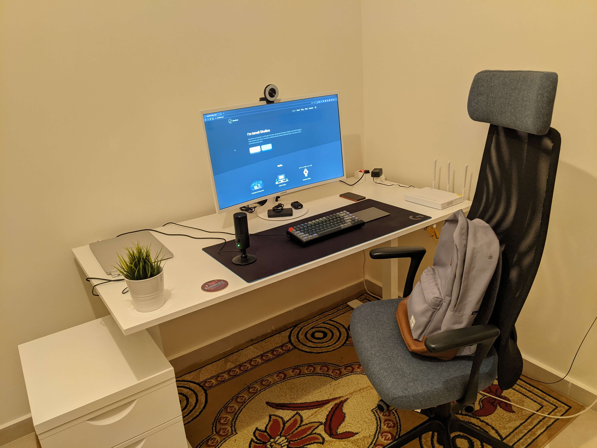

A list of tools I use whether for:

- Personal side projects
- My full time job
- Or working with clients

## Design tools

- Adobe Illustrator for logo, icon and illustration design
- Adobe XD for designing user interfaces & wireframes
- [Photopea](https://www.photopea.com/?ref=smakosh.com) for editing pictures & memes
- Final cut pro for editing videos
- Dribbble/Behance for inspiration and work showcase.

## Code

The code editor I'm currently using is VSCode

I share my code & look for inspiration on:

- GitHub
- Codepen
- CodeSandbox

If I’m simply coding an interface that I might integrate into a web app I use plain HTML/CSS & vanilla JavaScript.

But if I'm working on a landing page, documentation website, blog or even a large web app I use:

### Primary stack

- The JAM stack:
  - Gatsby or Next
  - Serverless functions written in JavaScript/TypeScript (when required)
  - Headless CMS (when required)
  - Markdown, Yaml, Json etc... (when required)

> Have used Jekyll and Pelican before

For CSS, I’m cool to use what ever tech available out there that makes my task done quickly & well, I have personally used Bootstrap 3 & 4,Bulma, Lostgrid, Materliaze, Skeleton, Tailwind CSS, Tachyons & made my own micro CSS framework called [Unnamed](https://unnamed.smakosh.com/) that has over 200 stars on GitHub, but I prefer coding with vanilla CSS or CSS in JS using styled-components or CSS modules, because I enjoy styling my elements from scratch since the components are fully reusable with React.

I have used Theme UI and styled-system as well, I do think they are good and useful and I do recommend them.

I'm working on a headless UI React library [Ontwik UI](https://github.com/Ontwik-Dev/ontwik-ui).

### Secondary stack

- MERN/PERN stack:
  - MongoDB/Postgres
  - Mongoose/Sequelize/Prisma and considering using TypeORM
  - Express
  - React (CRA/Next js)
  - Node Js

The MERN/PERN stack is my secondary stack for building web apps

> Checkout my [CRA boilerplate](https://github.com/smakosh/CRA-boilerplate), will open source my Next js boilerplate ASAP as well.

I use Git bash as my terminal when I’m on windows, iTerm2 with "oh my zsh" themes when I’m on macOS.

> Checkout my [REST API boilerplate](https://github.com/smakosh/rest-api-boilerplate-v2), will open source a GraphQL API boilerplate soon too.

### Optional tools

This can be part of the JAM stack

> the "A" part on JAM which stands for APIs

- Firestore
- FaunaDB
- Firebase auth
- Auth0
- Algolia
- Stripe
- etc...

### Mobile stack

- React Native
  > I have used Ionic before, I didn't like it as much as RN.

For native apps, I use React native to build mobile apps (Ios & Android). I also have a personal [boilerplate](https://github.com/smakosh/RN-personal-boilerplate) that I use to speed up the process.

### Deployment

- Vercel using their GitHub intergration
- Digital Ocean in a manual way
- App Store / Play Store using Fastlane

### Domain name provider

- Namecheap
- Google

## Issue, expenses/income tracking and project management

- [Trello](https://trello.com/?utm_source=smakosh.com) - for Personal expenses/income tracking
- [Notion](https://notion.so/?utm_source=smakosh.com) - for tracking todos on different projects I'm working on
- [Linear](https://linear.app/?utm_source=smakosh.com) - for tracking issues on Personal projects
- [Clubhouse](https://clubhouse.io?utm_source=smakosh.com) - for project management with clients

## Bank

- Attijariwafa Bank
- Mercury Bank

## Growth

For growth, I focus more on building useful products that users really need in their lives then I simply share it on this blog, Product Hunt, Hacker news, Reddit and on social media.

## Setup

### Laptop

> Personal

- [MacBook Pro 2019 16"](https://amzn.to/3gMSwxw)
  - Display: 16" retina screen
  - CPU: 2.3 GHz 8-Core Intel Core i9
  - GPU: Intel UHD Graphics 630 1536 MB
  - Ram: 16 GB 2667 MHz DDR4
  - SSD: 1 Tb

### Equipments

- Monitor: [Samsung Curved monitor](https://amzn.to/3moe30J)
- Keyboard: [Keychron K2 keyboard RGB brown keys](https://amzn.to/3ngeUBJ)
- Main Headset: [Sony WH-1000XM4](https://amzn.to/3mhv2kY)
- Earphones: [Apple Airpods](https://amzn.to/2WbyNxV)
- Microphone: [Razer Seiren X](https://amzn.to/38jk1dj)
- Desk: Skarsta Ikea desk (adjustable height)
- Mouse: [Logitech MX Master 3](https://www.logitech.com/en-us/products/mice/mx-master-3.html)
- Mousepad: [Logitech G840 XL GAMING MOUSEPAD](https://amzn.to/349KdGQ)
- Chair: [JÄRVFJÄLLET](https://amzn.to/3a8dRjx)
- Webcam: [Razer Kiyo](https://amzn.to/3nf0otS)

### Phones

- For Android, I'm using the Google Pixel 2 with a Dbrand dragon skin
  - Android 11
- For iOS, I'm using the iPhone 13 Pro
  - iOS 15.2

Previously, I was carrying only a Nexus 6p which I had to stop using due to these [reasons](/pixel-2-review-and-why-Nexus-6p-is-a-bad-choice)

### Cameras

At the moment, I'm only carrying with me a [GoPro hero 7 black edition limited edition](https://amzn.to/2WdROzU)

### Ai assistant

Currently, I'm using a Google home mini

### VR

[Google VR 1st gen headset](https://amzn.to/3nhQK9R)

Full setup with pictures can be found [here](https://docs.google.com/document/d/1falYEEHhJxq4HIXwOPoc4lk0AYsfHY4U6ZCcY4Srs8g/edit?usp=sharing)
